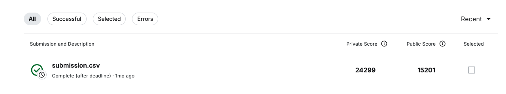

# Formula One Lap Time Prediction Challenge

This repository contains my submission for Nick Wan's Formula One Lap Time Prediction Challenge. This competition was a live data science event aimed at predicting the time required for Formula One drivers to complete laps on various circuits. The objective was to build a model with the lowest Root Mean Squared Error (RMSE) for lap time predictions.

## Project Overview

The competition required participants to design and implement a machine learning model in just two hours. My initial approach involved a deep learning model; however, due to suboptimal results, I pivoted to using **XGBoost** (`XGBRegressor`) for this task, which provided better accuracy.

- **Final Private Score**: 24299
- **Final Public Score**: 15201

## Features and Approach

The dataset includes various features related to drivers, circuits, and car performance metrics. Key steps in my approach were:

1. **Data Preprocessing**: Basic cleaning and feature engineering were performed to make the dataset compatible with the XGBoost model.
2. **Model Selection**: Although I started with a deep learning model, I switched to **XGBRegressor** due to its superior performance in handling structured data within the limited competition timeframe.
3. **Evaluation Metric**: RMSE (Root Mean Squared Error) was used as the evaluation metric.

This project demonstrates the use of traditional machine learning techniques in high-speed competitions where time and efficiency are critical factors.
